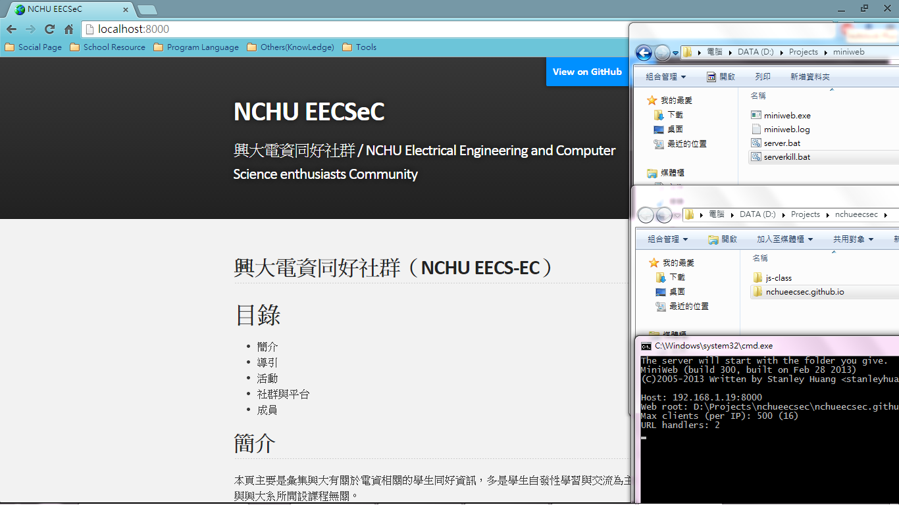

MiniWeb 簡易測試伺服器
====

簡介
----

如果你是一位新手網頁設計師，想學習HTML, CSS, Javascript的Windows用戶

非Windows用戶請直接找 apache 相關套件安裝

如果想學習php等伺服器語言的請直接找 xampp 安裝

安裝方法
----

Step 1. 請直接按右方的 "Download ZIP"，解壓縮至任意區

Step 2. 將你要Host的資料夾拖曳至 server.bat

Step 3. 如果有顯示資訊請直接縮小，並將瀏覽器連線至 http://localhost:8000

Step 4. 使用CMD的用戶可以直接用以下指令呼叫之

    %CD%\server.bat %folder%
    
    REM %CD% = server.bat 所在資料夾
    REM %folder% = 想要 Host 的資料夾

參數調整
----

MiniWeb Discuss: http://sourceforge.net/p/miniweb/discussion/319932/thread/ec7b8e3c/

根據作者Discuss表示，你可以使用以下參數呼叫 MiniWeb.exe

    -p port (integer)
    -r path (path to dir)
    -l logfile (path to file)
    -m maxclients (integer)
    -d ListDirectories (boolean)
    
server.bat 除了 -r 參數以外，其他參數你可以在該行指令進行調動

授權
----

本Repo依循MiniWeb使用以下授權

GNU Library or Lesser General Public License version 2.0 (LGPLv2)

MiniWeb程式網站：http://sourceforge.net/projects/miniweb/

操作截圖
----

